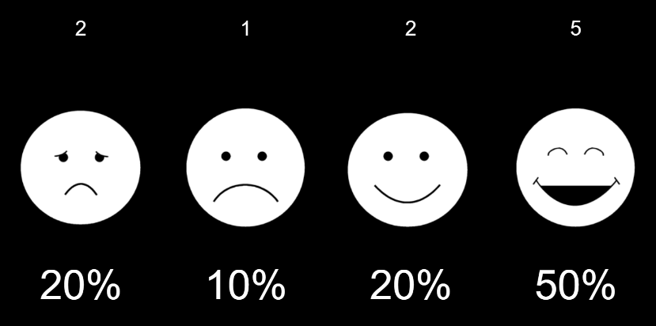

# Smileyometer (JavaScript, p5.js)

This is * *a proof of concept* project developed using [p5.js](http://p5js.org/) Javascript library. The main aim of the project was to show how to rapidly implement the smiley face scale with open source code.

The application uses `localStorage` to store data during use and erases the data when reloading.

## Background Theory
*The smiley face scale is a familiar way of measuring customer experiences*, but has a number of other uses as well. There are many commercial applications and software available to gather such data. In this case the project was initially motivated by a need to measure the usability and user experience of a novel interfaces designed for people with disabilities. However, the first real use was to measure visitor satisfaction in one event for people with special needs. 
The smiley face scale variation used in this project is based on the *“Smileyometer”* published by Read, MacFarlane, and Casey (2009) in their study, 
*“[Endurability, Engagement and Expectations: Measuring Children’s Fun.](https://www.researchgate.net/publication/228870976_Endurability_Engagement_and_Expectations_Measuring_Childrenaposs_Fun)”*.

## Symbols
In this project we use [Sclera symbols](https://www.sclera.be) that are licensed by creative commons (CC BY-NC 2.0 BE)*, but you can use any images you like. Everyone is different and has different needs. For example, [Open Symbols](https://www.opensymbols.org/) has a collection of open-licensed picture symbols that can be used.

